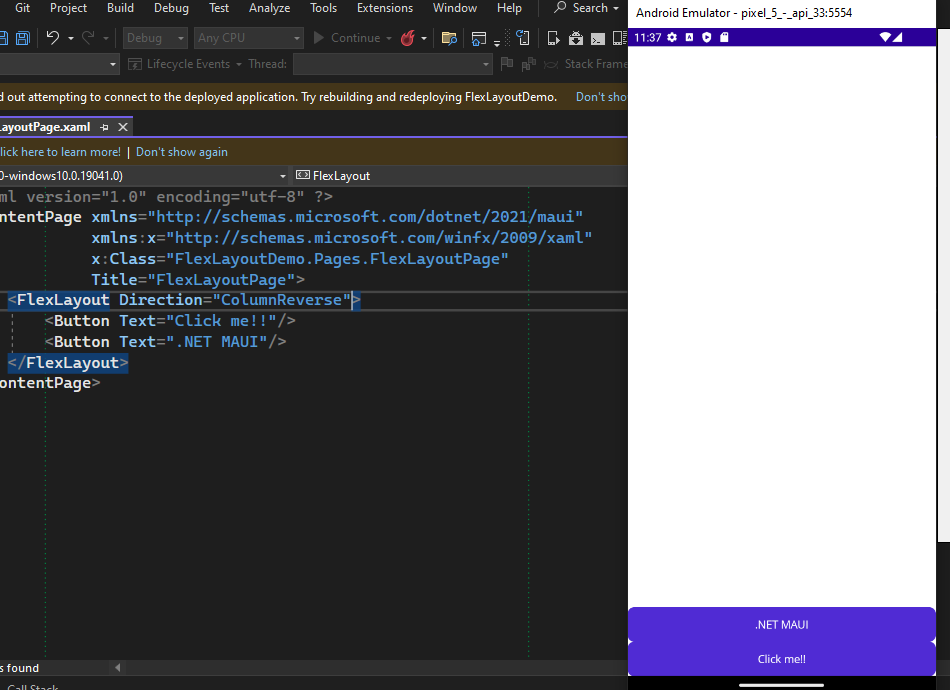
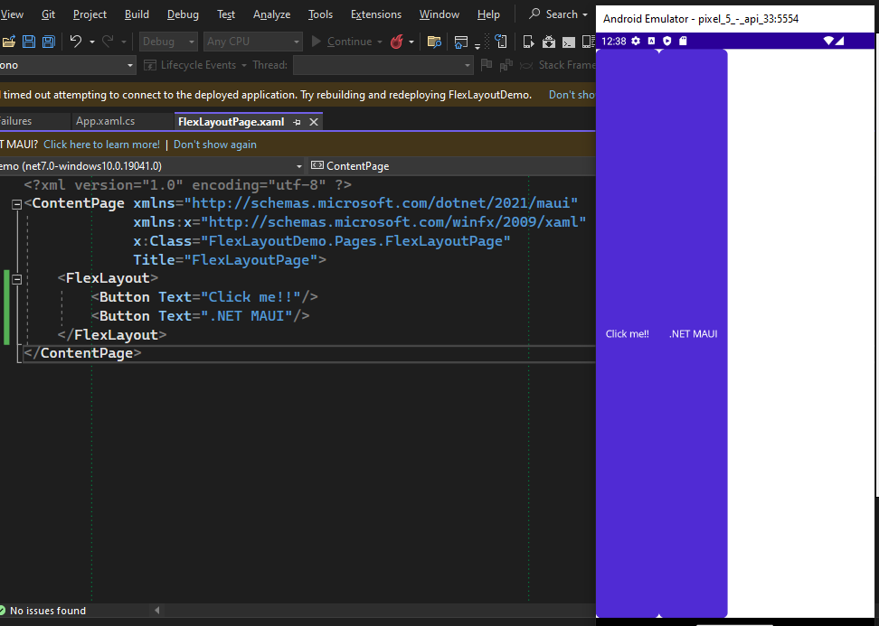

# Layout

# Proyecto 1

Estos nos ayudan a agrupar y organizar los controles de interfaz de usuario.


## Stack layout `<StackLayout>` `</StackLayout>`

Este tipo organiza los elementos de forma unidimensional, ya que verticalmente o horizontalmente

# Propiedades para etiquetas XAML

| Etiqueta          | Description                               | col3 |
| ----------------- | ----------------------------------------- | ---- |
| HorizontalOptions |                                           |      |
| Spacing           | Espaciado entre cada uno de los elementos |      |
|                   |                                           |      |
|                   |                                           |      |
|                   |                                           |      |
|                   |                                           |      |
|                   |                                           |      |
|                   |                                           |      |

# Resultado final


```xml
<?xml version="1.0" encoding="utf-8" ?>
<ContentPage xmlns="http://schemas.microsoft.com/dotnet/2021/maui"
             xmlns:x="http://schemas.microsoft.com/winfx/2009/xaml"
             x:Class="StackLayoutDemo.Pages.StackLayouDemo"
             Title="StackLayouDemo">
    <VerticalStackLayout VerticalOptions="Center" 
                         Spacing="10">
        <Label 
            Text="Welcome to .NET MAUI!"
            VerticalOptions="Center" 
            HorizontalOptions="Start" 
            BackgroundColor="DarkBlue"/>
        <Label 
            Text="Welcome to .NET MAUI!"
            VerticalOptions="Center" 
            HorizontalOptions="End" 
            BackgroundColor="DarkCyan"/>
        <Label 
            Text="Welcome to .NET MAUI!"
            VerticalOptions="Center" 
            HorizontalOptions="FillAndExpand" 
            BackgroundColor="DarkGoldenrod"/>
        <Label 
            Text="Welcome to .NET MAUI!"
            VerticalOptions="Center" 
            HorizontalOptions="Center" 
            BackgroundColor="Brown"/>
    </VerticalStackLayout>
</ContentPage>
```

# Proyecto 2 - VerticalStackLayout y HorizontalStackLayout

Cuando tegamos un contenedor y quieramos que los elementos se pongan
de forma vertical o horizontal, lo podemos hacer con las etiquetas
`<VerticalStackLayout>` o  `<HorizontalStackLayout>` ya que estos estan optimizados.

* Vertical Stack Layout


```xml
<?xml version="1.0" encoding="utf-8" ?>
<ContentPage xmlns="http://schemas.microsoft.com/dotnet/2021/maui"
             xmlns:x="http://schemas.microsoft.com/winfx/2009/xaml"
             x:Class="HorizontalVerticalStackLayoutDemo.Pages.VerticalStackLayoutDemo"
             Title="VerticalStackLayoutDemo">
    <VerticalStackLayout>
        <Label 
            Text="Welcome to .NET MAUI!"
            VerticalOptions="Center" 
            HorizontalOptions="Center" 
            BackgroundColor="DarkBlue"/>
        <Label 
            Text="Welcome to .NET MAUI!"
            VerticalOptions="Center" 
            HorizontalOptions="Center" 
            BackgroundColor="DarkCyan"
            />
        <Label 
            Text="Welcome to .NET MAUI!"
            VerticalOptions="Center" 
            HorizontalOptions="Center" 
            BackgroundColor="DarkGoldenrod"
            />
        <Label 
            Text="Welcome to .NET MAUI!"
            VerticalOptions="Center" 
            HorizontalOptions="Center" 
            BackgroundColor="DarkGrey"/>
    </VerticalStackLayout>
</ContentPage>
```

* Horizontal Stack Layout


```xml
<?xml version="1.0" encoding="utf-8" ?>
<ContentPage xmlns="http://schemas.microsoft.com/dotnet/2021/maui"
             xmlns:x="http://schemas.microsoft.com/winfx/2009/xaml"
             x:Class="HorizontalVerticalStackLayoutDemo.Pages.HorizontalStackLayoutDemo"
             Title="HorizontalStackLayoutDemo">
    <HorizontalStackLayout>
        <Label 
            Text="Welcome to .NET MAUI!"
            VerticalOptions="Center" 
            HorizontalOptions="Center" 
            BackgroundColor="DarkBlue"/>
        <Label 
            Text="Welcome to .NET MAUI!"
            VerticalOptions="Center" 
            HorizontalOptions="Center" 
            BackgroundColor="DarkCyan"
            />   
        <Label 
            Text="Welcome to .NET MAUI!"
            VerticalOptions="Center" 
            HorizontalOptions="Center" 
            BackgroundColor="DarkGoldenrod"
            />   
        <Label 
            Text="Welcome to .NET MAUI!"
            VerticalOptions="Center" 
            HorizontalOptions="Center" 
            BackgroundColor="DarkGrey"/>
    </HorizontalStackLayout>
</ContentPage>
```

# Proyecto 3 - Grid Layout

* Grid Layout
  Tipo de layout que organiza los diferentes tipos de controles en filas y columnas
  que pueden tener tamaños proporcionales o absolutos, por defecto
  este contiene una fila y una columna y ademas puede utilizarse como un diseño
  padre que pueda tener otros diseños hijos

  

  
* A Traves de la propiedad Grid.Row y Grid.Column podemos indicarle al elemento su posicion

  
* Si queremos que una columna ocupe el ancho de 2 columnas se puede hacer a traves de `Grid.ColumnSpan o Grid.RowSpan` y esta propiedad toma las columnas hacia la derecha o filas hacia abajo

  
* Tambien podemos especificar un tamaño a las filas con la propiedad `Height` y columnas con `Width` y el valor pueden ser

  * Unidades
  * `Auto` - Solo toma el espacio de los elementos dentro de la fila
  * `*` - Con este valor estrella indicamos que utilize todo el espacio disponible
  * `0.6*` - Con este valor especifico un porcentaje, en este caso es 60%
* Para cambiar el tamaño de un elemento ya sea Button, etc. lo
  hacemos con la propiedad `HeightRequest`

  

  
* Otra Forma de especificar filas y columnas
  

```xml
<?xml version="1.0" encoding="utf-8" ?>
<ContentPage xmlns="http://schemas.microsoft.com/dotnet/2021/maui"
             xmlns:x="http://schemas.microsoft.com/winfx/2009/xaml"
             x:Class="GridDemo.Pages.GridDemo"
             Title="GridDemo">
    <!--<Grid>
        <Grid.RowDefinitions>
            <RowDefinition Height=".8*"></RowDefinition>
            <RowDefinition Height=".2*"/>
        </Grid.RowDefinitions>
        
        <Grid.ColumnDefinitions>
            <ColumnDefinition/>
            <ColumnDefinition/>
        </Grid.ColumnDefinitions>
        
        <Button Text="Click me" HeightRequest="200"/>
        <Button Text=".Net MAUI" 
                Grid.Row="1" 
                Grid.Column="0" 
                Grid.ColumnSpan="2"
                ></Button>
    </Grid>-->
    
    <Grid 
        RowDefinitions=".6*, .4*"
        ColumnDefinitions=".2*, .8*"
        >
        <Button Text="Click me" HeightRequest="200"/>
        <Button Text=".Net MAUI" 
            Grid.Row="1" 
            Grid.Column="0" 
            Grid.ColumnSpan="2"
            ></Button>
    </Grid>
</ContentPage>
```
# Proyecto 4 - Absolute Layout

Este layout se utiliza para posicionar y dimensionar los controles utilizando
valores explicitos, la posicion se especifica mediante la esquina superior
izquierda de cada uno de los controles en relacion con la esquina superior
izquierda de absolute layout en unidades independientes del dispositivo.

* Para posicionar un elemento con valores absolutos necesitamos acceder a la
  propiedad `AbsoluteLayout.LayoutBounds="ValX, ValY, ValWidth, ValHeight"`

  
* Para posicionar un elemento con porcentajes lo hacemos de la siguiente
  manera `AbsoluteLayout.LayoutFlags="VariosValoresComoConstantes"` y cuando utilizamos este, tambien depende del anterior propiedad.

  
  
* Asi como podemos cambiar las dimensiones, tambien podemos posicionar los elementos

  
* Y si quiseramos que todos los valores fueran proporcionales, deberiamos
  de utilizar el valor de ``All``

  

```xml
<?xml version="1.0" encoding="utf-8" ?>
<ContentPage xmlns="http://schemas.microsoft.com/dotnet/2021/maui"
             xmlns:x="http://schemas.microsoft.com/winfx/2009/xaml"
             x:Class="AbsoluteLayoutDemo.Pages.AbsoluteLayoutPage"
             Title="AbsoluteLayoutPage"
             BackgroundColor="DarkRed"
             >
    <AbsoluteLayout>
        <Button Text="Click Me!!"/>
        <Button Text=".NET MAUI" 
                AbsoluteLayout.LayoutBounds=".5, .5, .5, .5"
                AbsoluteLayout.LayoutFlags="All"
                />
    </AbsoluteLayout>
</ContentPage>
```

# Proyecto 5 - FlexLayout

Es un layout que puede organizar los controles horizontalemente y verticalmente
en una pila y tambien pueden volver sus hijos si hay demasiados, para que
quepan en una sola fila o columna.
Este layout puede controlar la orientacion y alineacion y adaptarse a diferentes
tamaños de pantalla

* Tenemos una propiedad en FlexLayout llamada `Direction` al cual le podemos asignar
  * `Column` los elementos se alinearan en una sola columna.
    
  * `ColumnReverse` los elementos son apilados desde la parte inferior hasta la parte
    superior
    
  * `Row` es el valor por default
    
  * `RowReverse`
    

Tenemos tambien la propiedad `AlignItems` y nos va a servir para modificar como
se van a distribuir los diferentes elementos que formen parte del
FlexLayout y podemos utilizar el valor.

* `Stretch` comportamiento por default
  
* `Center` posiciona los elementos en el centro de este FlexLayout
  
* `Start`
  
* `End`
  
* `FlexLayout.Grow = "1"` significa que queremos utilizar todo el espacio disponible entre 2 elementos
* `FlexLayout.Basis="50"` nos permite indicar que queremos que se utilize una cantidad fija, es decir que que queremos que el elemento tenga un
  ancho especifico baso en el valor
  de la propiedad
* `FlexLayout.Order="-1"` la propiedad es para ponerle un orden a los elementos del FlexLayout, y como le ponemos -1 significa que siempre va a a estar ordenado antes de zero. Es decir que queremos posicionarlo los mas a la izquierda que podamos.


```xml
<?xml version="1.0" encoding="utf-8" ?>
<ContentPage xmlns="http://schemas.microsoft.com/dotnet/2021/maui"
             xmlns:x="http://schemas.microsoft.com/winfx/2009/xaml"
             x:Class="FlexLayoutDemo.Pages.FlexLayoutPage"
             Title="FlexLayoutPage">
    <FlexLayout Direction="Column">
        <!-- Header -->
        <Label Text="HEADER"
               FontSize="18"
               BackgroundColor="Aqua"
               HorizontalTextAlignment="Center"       
               />

        <!-- Body -->
        <FlexLayout FlexLayout.Grow="1">
            <!-- Content -->
            <Label Text="CONTENT"
               FontSize="18"
               BackgroundColor="Gray"
               HorizontalTextAlignment="Center"       
               VerticalTextAlignment="Center"       
               FlexLayout.Grow="1"
               />

            <!-- Navigation items -->
            <BoxView FlexLayout.Basis="50"
                     FlexLayout.Order="-1"
                Color="Blue"
                />

            <!-- Aside items -->
            <BoxView FlexLayout.Basis="50"
                Color="Green"
                />
        </FlexLayout>
        
        <!-- Footer -->
        <Label Text="FOOTER"
           FontSize="18"
           BackgroundColor="Pink"
           HorizontalTextAlignment="Center"       
           />
    </FlexLayout>
</ContentPage>
```